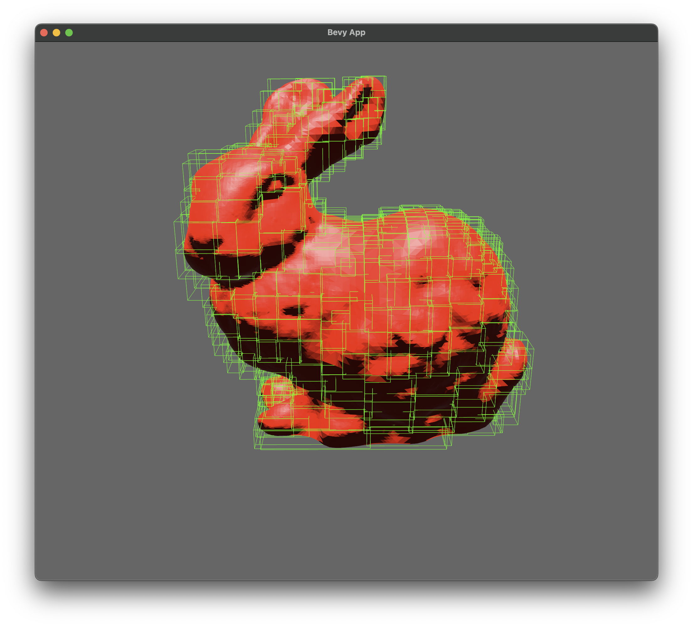

# 3d mesh operation in rust 

## Mesh Types
- vertex index mesh
- half-edge mesh
- winged-edge mesh

double direction convert between each type

all mesh types support bvh tree, which makes fast query possible

## Main Ability
### create mesh
- mesh primitives
- load from stl

### operate mesh
- transform mesh
- boolean operation
- mesh query (fast ray cast, fast collision detection, fast distance compute)

### mesh io
- stl
- obj

### mesh primitives
- cone
- cube
- cylinder
- plane
- sphere
- torus

## features road map
- [x] vertex indices mesh 
    - [x] stl io
    - [ ] obj io
    - [x] half-edge mesh convertion
    - [ ] transform

- [x] half-edge mesh 
    - [x] vertex indices mesh convertion
    - [ ] transform

- [ ] bvh tree 
    - [x] tree data structure
    - [x] aabb bvh
    - [ ] bounding sphere bvh
    - [x] bvh tree build
    - [x] fast intersect test 
    - [ ] generic bounding volume support

- [ ] boolean operation
    - [ ] triangle intersect test
    - [ ] winged-egde data structure

## develop todos
- [ ] unify all mesh types to one
    ??? user don't care what types of mesh are, dont let user read docs

